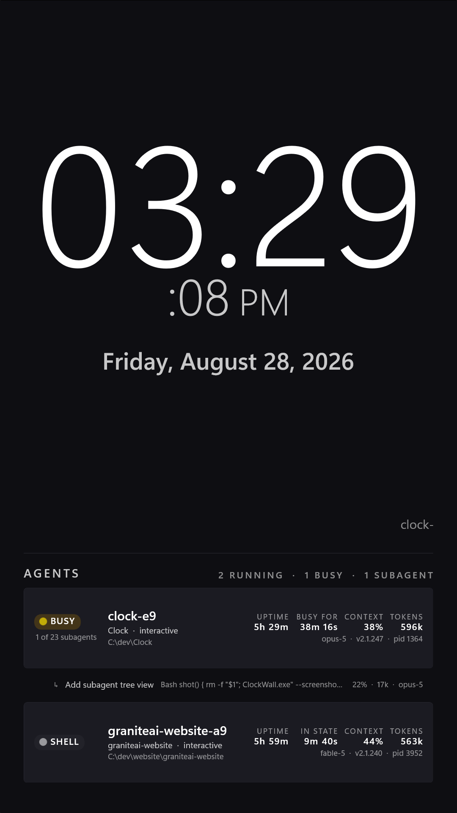

# ClockWall

An always-on wall or kiosk dashboard for a 1080x1920 portrait display. Built to run continuously and be read from across a room.

A large digital clock sits at the top, with today's date underneath. Under that, a slow ticker scrolls what each running agent is doing right now. Below that is a live list of the Claude Code agent sessions currently running on the machine, with the subagents running inside each one indented beneath it.



## What a session row shows

Name, project folder, session kind, working directory, BUSY/IDLE status, uptime, time in the current state, context used as a percentage, total output tokens, model, Claude Code version, and pid.

A session running subagents also shows a tally under its status pill, `1 of 23 subagents` — running now, out of every subagent that session has started.

Example rows as rendered, with one subagent indented under the session that spawned it:

```
clock-e9             BUSY  Clock . interactive             2h 52m  8m 24s  27%  419k   opus-5 . v2.1.247 . pid 1364
  1 of 23 subagents
    | Add subagent tree view   Bash git status                       22% . 17k . opus-5
graniteai-website-a9 BUSY  graniteai-website . interactive 3h 23m     53s  42%  545k   fable-5 . v2.1.240 . pid 3952
```

## Subagents

A subagent runs inside its parent session's process. It has no pid and no registry file, so the registry alone shows nothing for it — a session can be busy running an Agent tool with no sign of what that agent is doing.

They are found through the transcripts the parent writes for them:

```
~/.claude/projects/<slug>/<sessionId>/subagents/agent-<agentId>.jsonl
~/.claude/projects/<slug>/<sessionId>/subagents/agent-<agentId>.meta.json
~/.claude/projects/<slug>/<sessionId>/subagents/workflows/wf_<id>/agent-<agentId>.jsonl
```

The transcript is the same format as a session's, so the same reader produces the subagent's context, tokens, model and current activity with no parsing of its own. The `.meta.json` beside it gives the name (its `description`, the label typed when it was spawned) and the model it was asked for; workflow agents carry no description and fall back to their agent type. The `journal.jsonl` in a workflow directory is not an agent and is skipped.

### Liveness is a heuristic here

There is no status field for a subagent and no process to ask about, so ClockWall infers it: a subagent counts as running if its transcript was written to in the last 45 seconds **and** its parent session's own status is `busy`. The parent check is what makes it worth trusting — a subagent cannot be working while the session hosting it is not.

This is weaker than the pid check a session gets. A subagent that is killed or crashes reads as running until its transcript goes stale, and one that spends longer than the window inside a single slow tool call reads as finished until it writes again.

### At scale

Sessions are budgeted first. Every session that physically fits gets a card, at full size, before any subagent gets a row; subagents spend what is left over, so a session running twelve of them can never be pushed off the display by its own children. When there is no room for child rows, the count under the status pill is what the session shows instead. The header counts sessions and subagents separately (`5 RUNNING · 3 BUSY · 9 SUBAGENTS`), and anything that did not fit is named in the footer (`6 MORE SUBAGENTS`), because silent truncation is the failure mode that matters on a wall.

Cost is kept flat the same way. Liveness is a file timestamp, which is read for every subagent on every poll; the transcript is opened and parsed only for the handful of rows the measured budget can actually show. Five sessions with a dozen subagents each is sixty transcripts, and the display polls forever.

## How it finds running sessions

Claude Code keeps a live registry at `~/.claude/sessions/<pid>.json`, one file per running session, holding the pid, session id, working directory, status (busy or idle), version, and timestamps.

A registry file can outlive its process, so ClockWall only counts a session as running if the pid resolves to a live process and that process's start time matches the file's `startedAt`. That check exists to rule out pid reuse.

Token and model numbers aren't in the registry. They come from the session transcript at `~/.claude/projects/<slug>/<sessionId>.jsonl`, where `<slug>` is the working directory with `:` and `\` replaced by `-` (so `C:\dev\Clock` becomes `C--dev-Clock`).

Context used is the last assistant message's `input_tokens` plus `cache_read_input_tokens` plus `cache_creation_input_tokens`. Total tokens is the sum of `output_tokens` across the transcript. Summing input tokens across turns instead would double count cache reads by a huge margin, so ClockWall doesn't do that.

The ticker line comes out of the same read: the last `tool_use` block in the newest assistant message gives the tool name, and one field of its input (`file_path`, `command`, `pattern`, `description` or `prompt`) gives the hint beside it, as `Edit MainWindow.xaml.cs` or `Bash git status`. A tool carrying none of those shows just its name. Only the first line of a hint is used, and every path is reduced to its file name - partly because that reads better from a distance, and partly because a wall display should not publish the directory structure of the machine next to it.

These transcripts grow without bound (some are already megabytes), so ClockWall reads them like a tail follower: it keeps a byte offset and a running total per session, and only reads the bytes appended since the last poll.

Refresh runs on both a FileSystemWatcher and a periodic timer, because file watchers miss events on their own, and a display meant to run unattended needs to recover from that.

## Requirements

.NET 10 SDK. No Visual Studio needed. Windows 11.

## Build and run

```
dotnet build ClockWall.csproj -c Release -r win-x64
.\bin\Release\net10.0-windows10.0.19041.0\win-x64\ClockWall.exe
```

## Deploying

```
.\deploy.ps1              # build, install to %LOCALAPPDATA%\Programs\ClockWall, relaunch
.\deploy.ps1 -NoRestart
```

Rebuilding with `dotnet build` doesn't update the installed copy. If a change doesn't seem to take effect, you're probably still looking at the old binary. `deploy.ps1` exists so you don't have to remember that.

### Smart App Control will block this build

The build output is unsigned. On a machine with Smart App Control enabled, Windows can refuse to load unsigned managed assemblies, and the app dies at startup with:

```
FileLoadException: Could not load file or assembly '...\ClockWall.dll'.
An Application Control policy has blocked this file. (0x800711C7)
```

with a matching CodeIntegrity event 3077 in the event log.

This hits a self-contained `dotnet publish` hardest, because that bundles its own unsigned copy of the .NET and Windows App SDK runtimes. The framework-dependent build that `deploy.ps1` installs is less exposed, since it loads the runtime from Program Files where Microsoft has signed it — but it is not immune. SAC decides per binary on reputation, so a freshly compiled `ClockWall.dll` can be blocked too, and the same file may load fine later.

If you are running Smart App Control, sign the output or turn SAC off on the wall machine. Don't rely on it happening to work.

## Configuration and flags

- `--fullscreen`
- `--screenshot <path>` renders the window to a 1080x1920 PNG and exits.
- Esc exits. F11 toggles fullscreen.
- The window is draggable from anywhere on its surface, using the native title bar (`SetTitleBar`) rather than custom mouse handling. It remembers where you put it, in `%LOCALAPPDATA%\ClockWall\window-position.txt`. On launch, that remembered position is checked against the currently connected displays, so unplugging a monitor won't strand the window off screen.
- While running, ClockWall keeps the display awake (`SetThreadExecutionState`) and restores the previous setting on exit.

## Design

The UI is WinUI 3 (Windows App SDK) on .NET 10, unpackaged, in C# and XAML, targeting Windows 11. It follows Microsoft's `winui-design` skill, which targets WinUI 3 directly, so its guidance on Fluent brush keys, `ThemeResource`, `x:Bind`, and `ListView` applied without translation.

Everything is themed from one file, `Themes/Theme.xaml`. No panel hardcodes a color or font, so a reskin means editing that one file.

Mica is not used, and that's deliberate rather than an oversight. A full-bleed wall display has no desktop behind it, and Mica's backdrop falls back to a solid fill whenever the window isn't in the foreground, which for a wall panel is the normal state. That fallback made the background lighter than the cards sitting on it, inverting the intended elevation. A flat dark background sidesteps the problem.

## Known limitation

The context percentage needs to know the size of the context window, and the transcript doesn't record one. The model id reads `claude-opus-5` whether the session is running the 200k or the 1M context variant. ClockWall guesses: if observed context exceeds roughly 200k, it assumes the 1M window; otherwise it assumes 200k. A session actually running the 1M window but currently under 200k tokens will show a percentage that's too high.

## Credits

Design follows Microsoft's `winui-design` skill: https://github.com/microsoft/win-dev-skills

## License

MIT
